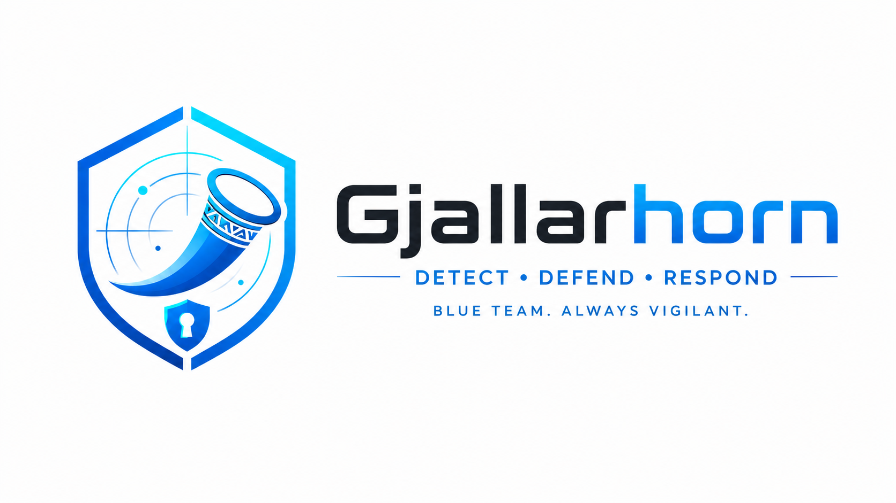
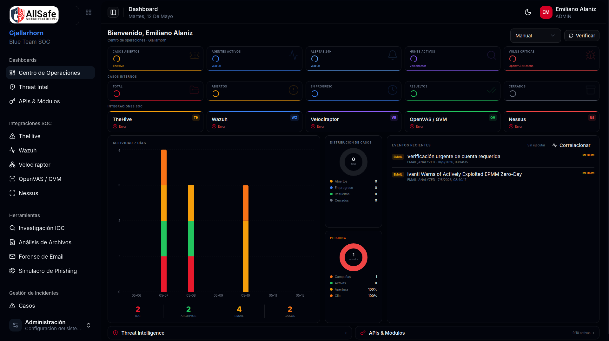
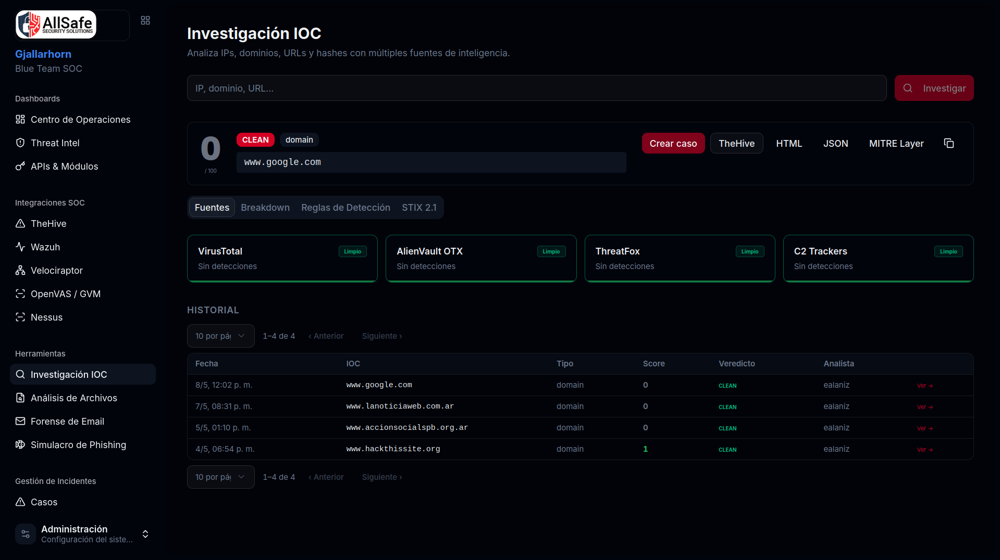
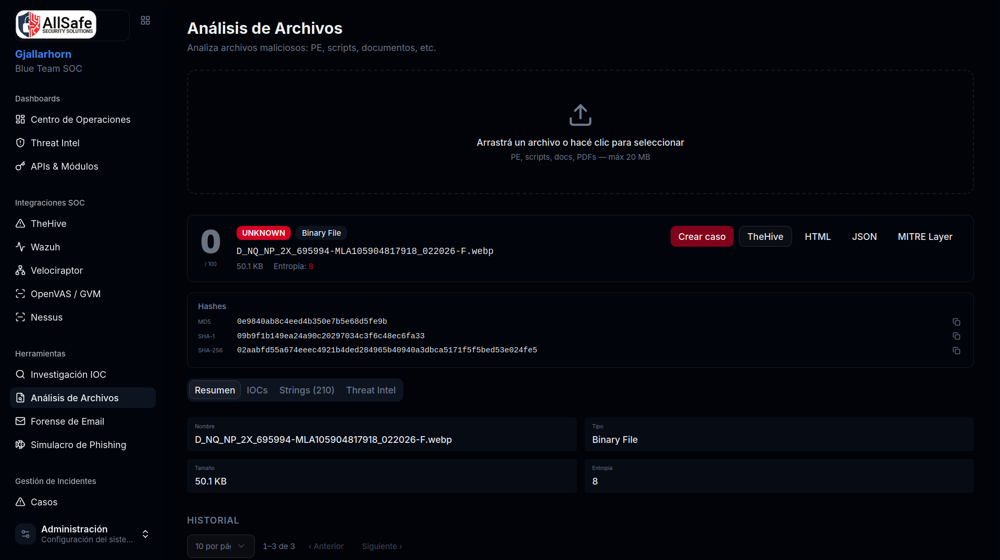
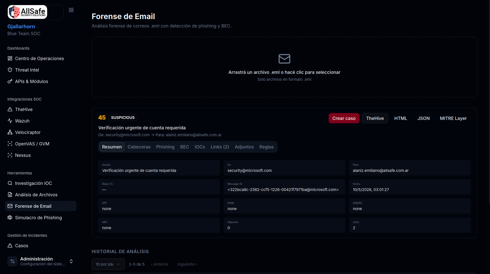
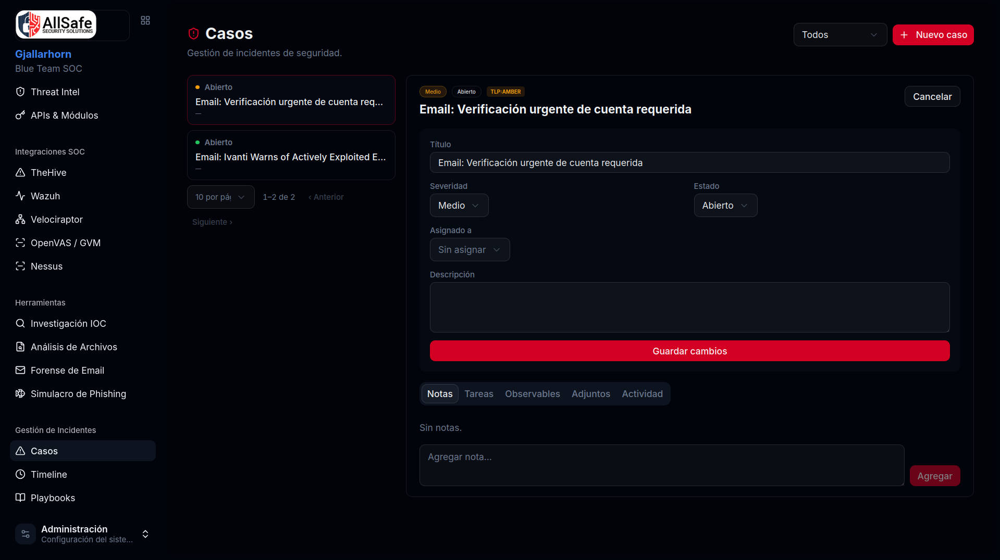
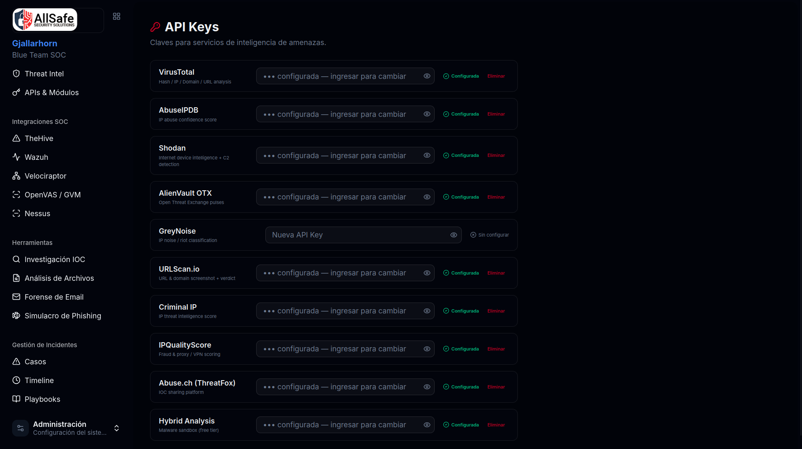

[](README.es.md)

<div align="center">
  

  # Gjallarhorn Community - Blue Team Platform

  **Open-source SOC platform for Blue Team operations**

  *Powered by [AllSafe Security Solutions](https://www.allsafe.com.ar)*

  
  
  
  
  

  [](https://allsafe.com.ar/en/gjallarhorn-community/)
</div>

---

Gjallarhorn Community is a free, open-source SOC platform for Blue Team operations - integrating threat investigation, malware analysis, email forensics, case management, and SOC tool integrations into a single interface.

> The name comes from the Gjallarhorn - Heimdall's horn in Norse mythology. When it sounds, it warns the gods' army of imminent danger.

---

## What is Gjallarhorn Community?

Gjallarhorn Community includes:

- **20+ Threat Intelligence sources** (VirusTotal, Shodan, AbuseIPDB, AlienVault OTX, GreyNoise, Criminal IP, Google Safe Browsing and more) to investigate IPs, domains, URLs and hashes
- **SOC integrations**: Wazuh, Velociraptor and OpenVAS/GVM
- **Static file analysis**: PE executables, PowerShell/Batch/VBS scripts, Office documents, PDFs - with ransomware detection, Cobalt Strike beacon detection, and C2 framework identification
- **Email forensics**: SPF/DKIM/DMARC analysis, phishing detection and BEC (Business Email Compromise)
- **Case management** with notes, linked analyses, and attachments
- **Detection rule generation**: KQL (Sentinel/Defender), SPL (Splunk), SIGMA, YARA
- **STIX 2.1 export** for sharing intelligence in a standard format
- **Auth**: JWT (12h), TOTP 2FA (RFC 6238), account lockout, role-based access (`admin` / `analyst` / `viewer`)

> Looking for **email phishing campaign simulation**, **WiFi phishing (Munin)**, **TheHive**, **Nessus**, **AI analysis**, or **automatic correlation playbooks**? Those features are available in [Gjallarhorn Pro](https://www.allsafe.com.ar).

---

## Screenshots

<div align="center">

**Main Dashboard**
<br/>


<br/><br/>

| **IOC Investigation** | **File Analysis** |
|:---:|:---:|
|  |  |

<br/>

| **Email Forensics** | **Cases** |
|:---:|:---:|
|  |  |

<br/>

**Integration Settings**
<br/>


</div>

---

## Key Features

### IOC Investigation
- Parallel queries to 20+ sources using `Promise.allSettled()`
- Automatic scoring 0–100 with CLEAN / SUSPICIOUS / MALICIOUS / UNKNOWN verdict
- DGA detection (Domain Generation Algorithm) with 7 heuristics: Shannon entropy, consonant/vowel ratio, rare bigrams, known DGA families (GameOverZeus, Qakbot, Suppobox)
- C2 detection in Shodan banners: Cobalt Strike, Metasploit, Empire, Sliver, Havoc, Mythic and more
- Domain age via WHOIS (domains <7 days receive maximum penalty)
- Automatic generation of KQL, SPL, SIGMA and YARA detection rules

### SOC Integration
| Platform | Functionality |
|---|---|
| Wazuh | Agents, alerts (via OpenSearch indexer at :9200) |
| Velociraptor | Clients, hunts, artifact flows |
| OpenVAS / GVM | Scans and vulnerabilities (via GMP proxy at :9391) |

### File Analysis
- PE executables: entropy, sections, imports/exports, packer detection
- Scripts: PowerShell, Batch, JavaScript, VBScript - deobfuscation and IOC extraction
- Documents: Office (macros, OLE), PDF
- Ransomware detection: AES/ChaCha20 constants, ransom notes, VSS deletion
- Cobalt Strike Beacon detection: XOR decryption, config parsing, C2 extraction

### Email Forensics
- SPF, DKIM, DMARC, ARC analysis
- Received header chain and geolocation
- 10+ phishing detection checks: brand impersonation, lookalike domains, hyperlink mismatch
- BEC detection: urgency patterns, financial language, executive impersonation
- Automatic IOC extraction (IPs, domains, attachment hashes)

### Incident Management
- **Cases**: full lifecycle (open → investigating → resolved → closed), notes, observables, attachments
- **Timeline**: unified chronological log of all system events (IOCs, analyses, alerts, cases)

### Security & Auth

Security is a first-class feature here — the same hardening baseline as the commercial AllSafe suite:

- **JWT** — 12h expiry with `token_version` revocation: changing a password or disabling a user invalidates existing tokens immediately
- **TOTP 2FA** — RFC 6238, setup via QR code
- **Account lockout** — 5 failed attempts → 15-minute lockout, **persisted in the database** (survives restarts)
- **bcrypt** password hashing (per-user salt)
- **Security headers** (Helmet) + **HTTP rate limiting** (300 req/15 min; auth endpoints throttled separately)
- **Role-based access control** — `admin` / `analyst` / `viewer`
- **Audit log** — security-relevant actions recorded with user, IP and timestamp
- **100% parameterized SQL** — no string-built queries, no injection vectors (OWASP Top 10 2021)
- **Fail-fast startup** — the backend refuses to boot with a missing or default `JWT_SECRET`
- **CORS** locked to the configured origin (no wildcard)

---

## Community vs Pro

| Feature | Community | Pro |
|---|:---:|:---:|
| IOC Investigation (20+ sources) | ✅ | ✅ |
| File Analysis | ✅ | ✅ |
| Email Forensics | ✅ | ✅ |
| Cases & Timeline | ✅ | ✅ |
| Wazuh integration | ✅ | ✅ |
| Velociraptor integration | ✅ | ✅ |
| OpenVAS / GVM integration | ✅ | ✅ |
| TOTP 2FA + account lockout | ✅ | ✅ |
| Roles: admin / analyst / viewer | ✅ | ✅ |
| Audit log | ✅ | ✅ |
| Email phishing campaigns | ❌ | ✅ |
| WiFi phishing / evil twin (Munin) | ❌ | ✅ |
| In-person security training module | ❌ | ✅ |
| TheHive integration | ❌ | ✅ |
| Nessus integration | ❌ | ✅ |
| Automatic correlation playbooks | ❌ | ✅ |
| Advanced analysis engine | ❌ | ✅ |
| PDF export for audit reports | ❌ | ✅ |

> **Upgrade path**: Community and Pro share the same database schema. Upgrading = replace files + `npm install` + `pm2 restart`. No migration needed.

---

## Technology Stack

| Layer | Technology |
|---|---|
| Backend | Node.js 20 + Express |
| Frontend | React 18 + Vite |
| Database | MySQL 8.0+ or MariaDB 10.6+ |
| Auth | JWT (12h) + TOTP 2FA |
| Web server | Nginx |
| Process manager | PM2 |

---

## Installation

### Option A - Install script (recommended for Linux servers)

```bash
git clone https://github.com/allsafe-ar/Gjallarhorn-community.git
cd Gjallarhorn-community
chmod +x install.sh && sudo ./install.sh
```

Tested on Ubuntu 22.04 / 24.04 and Debian 12. Installs Node.js, MySQL, nginx and PM2 automatically.

### Option B - Docker

```bash
git clone https://github.com/allsafe-ar/Gjallarhorn-community.git
cd Gjallarhorn-community
cp .env.example .env
# Edit .env: set DB_PASSWORD, DB_ROOT_PASSWORD and JWT_SECRET (openssl rand -hex 32)
docker compose up -d
```

### Option C - Manual

```bash
# Backend
cd backend
npm install
cp .env.example .env
# Edit .env: DB credentials + strong JWT_SECRET (min 32 chars)
npm start   # port 3003

# Frontend
cd frontend
npm install
npm run build   # Production build → dist/
```

Default credentials (first run): `admin` / `admin123` - **change immediately**.

---

## Documentation

### API Keys Configuration (Threat Intelligence)
| Service | Documentation |
|---|---|
| VirusTotal | [docs/api-keys/virustotal.md](docs/api-keys/virustotal.md) |
| AbuseIPDB | [docs/api-keys/abuseipdb.md](docs/api-keys/abuseipdb.md) |
| Shodan | [docs/api-keys/shodan.md](docs/api-keys/shodan.md) |
| AlienVault OTX | [docs/api-keys/alienvault-otx.md](docs/api-keys/alienvault-otx.md) |
| GreyNoise | [docs/api-keys/greynoise.md](docs/api-keys/greynoise.md) |
| URLScan.io | [docs/api-keys/urlscan.md](docs/api-keys/urlscan.md) |
| Google Safe Browsing | [docs/api-keys/google-safe-browsing.md](docs/api-keys/google-safe-browsing.md) |
| Criminal IP | [docs/api-keys/criminalip.md](docs/api-keys/criminalip.md) |
| IPQualityScore | [docs/api-keys/ipqualityscore.md](docs/api-keys/ipqualityscore.md) |
| Abuse.ch (ThreatFox / MalwareBazaar / URLhaus) | [docs/api-keys/abusech.md](docs/api-keys/abusech.md) |
| Hybrid Analysis | [docs/api-keys/hybrid-analysis.md](docs/api-keys/hybrid-analysis.md) |

### SOC Integration Configuration
| Platform | Documentation |
|---|---|
| Wazuh | [docs/integrations/wazuh.md](docs/integrations/wazuh.md) |
| Velociraptor | [docs/integrations/velociraptor.md](docs/integrations/velociraptor.md) |
| OpenVAS / GVM | [docs/integrations/openvas.md](docs/integrations/openvas.md) |

---

## Acknowledgements

Gjallarhorn would not be possible without the work of the following organizations and open-source projects:

- [MITRE ATT&CK](https://attack.mitre.org/) - adversarial tactics and techniques framework
- [Wazuh](https://wazuh.com/) - open-source SIEM and threat detection platform
- [Velociraptor](https://docs.velociraptor.app/) - DFIR platform for remote artifact collection
- [Greenbone / OpenVAS](https://www.greenbone.net/) - open-source vulnerability scanner
- [VirusTotal](https://www.virustotal.com/) - file and threat indicator analysis
- [Abuse.ch](https://abuse.ch/) - free intelligence feeds: ThreatFox, MalwareBazaar and URLhaus
- [AbuseIPDB](https://www.abuseipdb.com/) - collaborative database of malicious IPs
- [Shodan](https://www.shodan.io/) - search engine for internet-exposed devices
- [AlienVault OTX](https://otx.alienvault.com/) - collaborative threat intelligence platform
- [GreyNoise](https://www.greynoise.io/) - internet noise classification vs. real threats

---

## Legal Notice

Gjallarhorn is designed exclusively for use in authorized environments: security research, Blue Team operations, and forensic analysis on own infrastructure or with explicit permission from the owner.

Analyzing indicators, files, or systems without authorization may constitute a legal violation in many jurisdictions. The authors assume no responsibility for misuse of this tool.

---

## Author

Created by **Eduardo Emiliano Alaniz** ([@h4wkby73](https://github.com/h4wkby73))
[AllSafe Security Solutions](https://www.allsafe.com.ar)

---

## Trademark Notice

The names "AllSafe", "AllSafe Security Solutions", "Gjallarhorn" and all associated logos are trademarks of AllSafe Security Solutions. The AGPL-3.0 license covering this software does not grant any rights to use these names or logos. You may not use them to identify, endorse or promote products derived from this software without prior written permission from AllSafe Security Solutions.

---

## License

GNU Affero General Public License v3.0 - see [LICENSE](LICENSE) file.

If you modify and deploy Gjallarhorn Community as a service, you must publish your modifications under the same license.

---

## Security

Found a vulnerability? Please report it privately - see [SECURITY.md](SECURITY.md).

---

<div align="center">
  <sub>Powered by <a href="https://www.allsafe.com.ar">AllSafe Security Solutions</a></sub>
</div>
